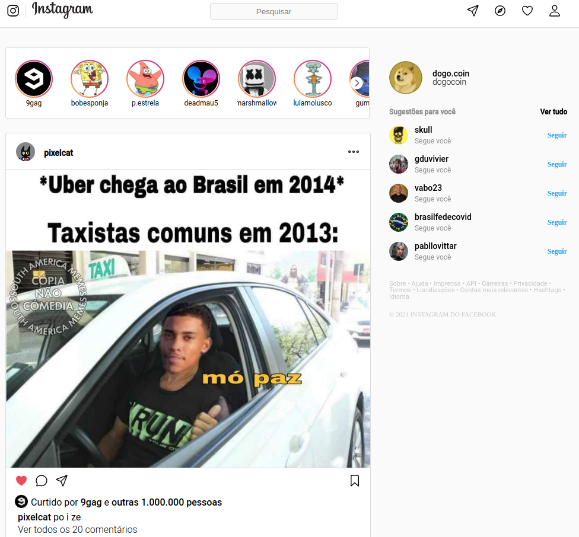
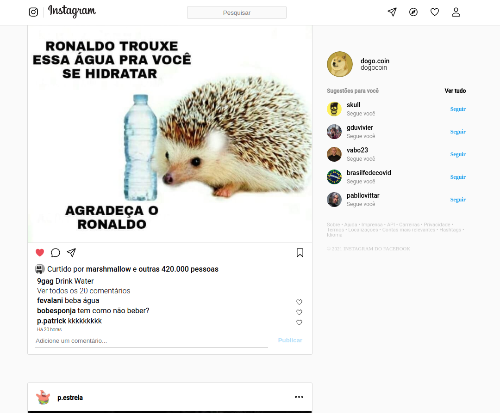
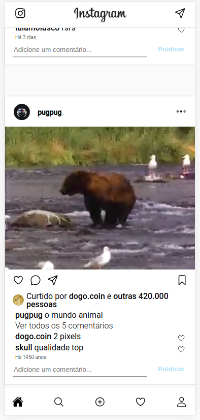

<h1 align="center">
    Projeto_Instagram
</h1>

 

<h4 align="center"> 
	 Status: Delivered.
</h4>

## Sobre

Projeto Instagram, segundo projeto realizado durante o ** Bootcamp Responde Aí ** do [Responde Aí](https://www.respondeai.com.br/).  
O foco deste projeto é desenvolver ainda mais as habilidades de Front End usando HTML5 e CSS3.

---

## Features

- [x] Layout Responsivo

- [x] Homepage desktop:

  - [x] Lista dos posts dos usuários;
  - [x] Sidebar com sugestões e informações do usuário;

- [x] Homepage mobile:

  - [x] Lista dos posts dos usuários;
  - [x] Footer com ícones de navegação;

---

## Layout

O layout da aplicação se encontra no Figma:

### Desktop

  
  

### Mobile

  
  

## Tech Used

Foram usadas as seguintes ferramentas para o desenvolvimento do projeto:

- ****
- ****

#### **Utilities**

- Prototype: **[Figma](https://www.figma.com/)** → **[Protótipo (Instagram)](https://www.figma.com/file/rrweaBwWqOc9pAzk288mKB/Projeto-Instagram?node-id=0%3A1)**
- Editor: **[Visual Studio Code](https://code.visualstudio.com/)**
- Fonts: **[Roboto](https://fonts.google.com/specimen/Roboto)**

---

## Authors

<a style="border-radius: 50px;" width="100px;" href="https://github.com/fevalani">
 
  
 <b>Fernando Valani</b></a>
  

## 

## License

👋🏽 Get in Touch!

---
